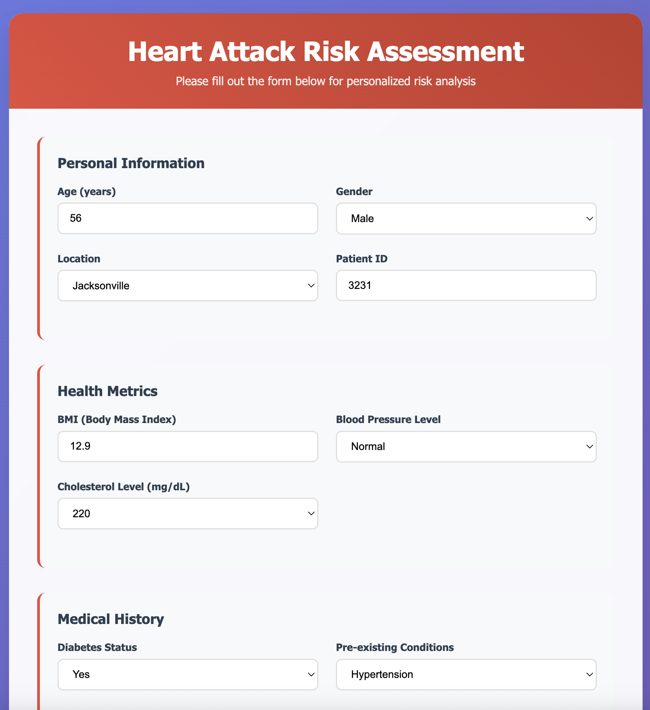

# Heart Attack Risk Prediction System

A machine learning-powered web application that predicts heart attack risk based on various health metrics, medical history, and vaccination information. This application uses Flask for the web interface and scikit-learn for the machine learning pipeline.

## 🚨 Important Notice

**This application uses dummy data and is for demonstration purposes only.** The predictions should not be used for actual medical diagnosis or treatment decisions. Always consult with qualified healthcare professionals for medical advice.

## 📋 Features

- **Interactive Web Interface**: User-friendly form to input patient data
- **Real-time Predictions**: Instant risk assessment using trained ML models
- **Comprehensive Data Collection**: Captures multiple health parameters including:
  - Personal information (age, gender, location)
  - Health metrics (BMI, blood pressure, cholesterol)
  - Medical history (diabetes, pre-existing conditions, smoking)
  - Vaccination information
- **Responsive Design**: Works seamlessly on desktop and mobile devices
- **Modern UI**: Professional medical-themed interface with smooth animations

## 🖥️ User Interface


*The application features a modern, responsive design with an intuitive form interface for data input and real-time prediction results.*

## 🚀 Deployment

This application has been successfully deployed on **Amazon Web Services (AWS)** and is accessible via web browser.

## 🛠️ Technology Stack

- **Backend**: Python, Flask
- **Machine Learning**: scikit-learn, pandas, numpy
- **Frontend**: HTML5, CSS3, JavaScript
- **Deployment**: AWS
- **Data Processing**: Custom preprocessing pipeline

## 📁 Project Structure

```
covid_vaccine_risk/
├── application.py
├── artifacts
├── logs
├── notebook
├── setup.py
├── src
│   ├── __init__.py
│   ├── components
│   │   ├── __init__.py
│   │   ├── data_ingestion.py
│   │   ├── data_preprocessing.py
│   │   ├── data_transformation.py
│   │   └── model_trainer.py
│   ├── exception_handler.py
│   ├── exception.py
│   ├── logger.py
│   ├── pipeline
│   │   ├── __init__.py
│   │   ├── predict_pipeline.py
│   │   └── train_pipeline.py
│   └── utils.py
├── templates
│   └── imgs
└── tests
    ├── __init__.py
    └── predictor_test.py
```

## 🔧 Installation & Setup

1. **Clone the repository**
   ```bash
   git clone https://github.com/esmaeil-rezaei/covid_vaccine_risk.git
   cd hcovid_vaccine_risk
   ```

2. **Create virtual environment**
   ```bash
   python -m venv venv
   source venv/bin/activate  # On Windows: venv\Scripts\activate
   ```

3. **Install dependencies**
   ```bash
   pip install -r requirements.txt
   ```

4. **Run the application**
   ```bash
   python application.py
   ```
Note to edit the last line to this to run locally.

```bash
if __name__ == "__main__":
app.run(host="0.0.0.0", port=8082, debug=True)
```
5. **Access the application**
   Open your browser and navigate to `http://localhost:8082`

## 📊 Input Parameters

The application collects the following patient information:

### Personal Information
- **Age**: Patient age in years
- **Gender**: Male or Female
- **Location**: US city location
- **Patient ID**: Unique patient identifier

### Health Metrics
- **BMI**: Body Mass Index
- **Blood Pressure**: Very Low, Low, Normal, High, Very High
- **Cholesterol Level**: 180-350 mg/dL (predefined levels)

### Medical History
- **Diabetes Status**: Yes/No
- **Pre-existing Conditions**: None, Hypertension, Diabetes, Heart Disease, Asthma
- **Smoking History**: Yes/No

### Vaccination Information
- **Vaccine Dose**: 1st Dose, 2nd Dose, Booster
- **Vaccination Date**: Date of vaccination

### Event Information
- **Heart Attack Date**: Date of heart attack (if applicable)

## 🧪 Testing

Run the test suite to ensure the prediction pipeline works correctly:

```bash
python tests/test_prediction.py
```

The test uses sample patient data to verify:
- Data pipeline functionality
- Model prediction capabilities
- Output format validation

## 🔍 How It Works

1. **Data Input**: User fills out the comprehensive health assessment form
2. **Data Processing**: Input data is processed through the preprocessing pipeline
3. **Feature Engineering**: Date features are extracted and categorical variables are encoded
4. **Prediction**: Trained machine learning model generates risk result as YES/NO
5. **Results Display**: Risk assessment is presented to the user

## 📈 Model Information

- **Model Type**: Machine Learning classifier (specific algorithm details in preprocessing pipeline)
- **Training Data**: Generated data randomly
- **Features**: 13+ input features including demographics, health metrics, and medical history
- **Output**: Numerical risk score

## ⚠️ Limitations & Disclaimers

- **Dummy Data**: This application uses simulated data for demonstration purposes
- **Not for Medical Use**: Predictions should not be used for actual medical diagnosis
- **Educational Purpose**: Designed to showcase ML application development
- **Consult Professionals**: Always seek qualified medical advice for health concerns

---

**Disclaimer**: This application is a demonstration project using dummy data. It is not intended for actual medical diagnosis or treatment decisions. Always consult with qualified healthcare professionals for medical advice.
